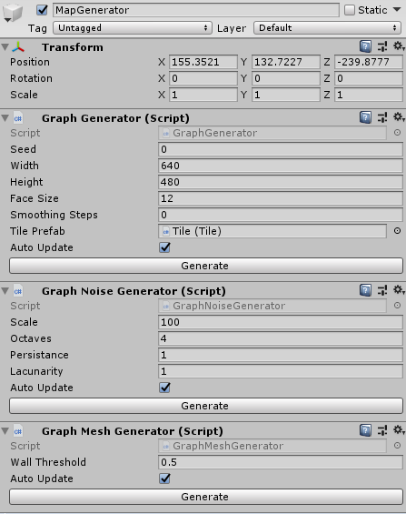

# unity-polygon-map-generator

## Summary
A Untiy Demo for a procedural polygonal map generator.

Inspired by [Amit Patel's guide to polygonal map generation](http://www-cs-students.stanford.edu/~amitp/game-programming/polygon-map-generation/). Uses [Triangle.Net](https://github.com/a5rGithub/triangle.net-1) for Delauny triangulations, and [Gregory Schlomoff's implementation a Poisson-disc sampling](http://gregschlom.com/devlog/2014/06/29/Poisson-disc-sampling-Unity.html) for initial vertex positions. Uses triangle centroids for corners.

Using [Sebastian Lague](https://www.youtube.com/watch?v=wbpMiKiSKm8&list=PLFt_AvWsXl0eBW2EiBtl_sxmDtSgZBxB3)'s implementation of Perlin Noise, each face is provided a value from 0 to 1, with a threshold value determining whether or not each face becomes a wall.

## For another time

* Add additional was of generation corners (circumcenter, incenter, random);
* Add connected rooms, enemies, loot. 